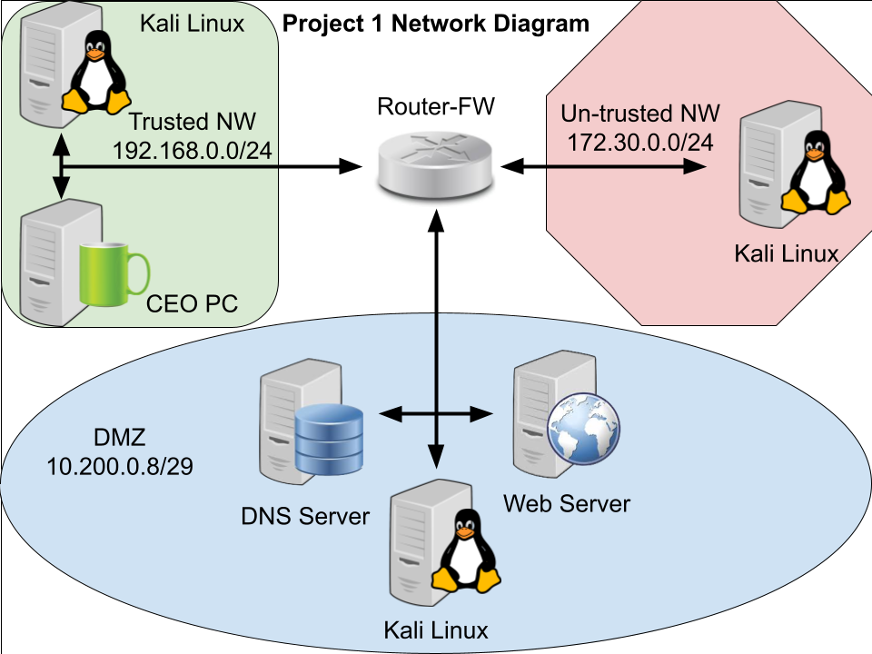

# Career Simulation 1: Creating a Secure Network

**TL;DR:** Designed and stood up a tri-homed DMZ network in VirtualBox for a client migrating from physical hardware to virtual infrastructure, then built a documented security baseline: resolved a real IP-misconfiguration issue on the CEO's PC, catalogued OS/IP configuration and open ports across every host, and used Wireshark to demonstrate that an ordinary FTP transfer exposes login credentials in plaintext.

## Scenario

As an IT subject matter expert, an IT company has a client who wants to upgrade their IT systems, but the client has a limited budget and no more physical space to install new equipment. The recommendation was to implement virtual machines instead of additional hardware to reduce costs and meet operational needs. The upgrade included a firewall, a PC for the CEO, an internal web server, an internal DNS server, and Linux machines for monitoring and cybersecurity tasks. Once the network was installed, the goal was to document its configuration and establish a security baseline by scanning for open ports.

## Environment & Architecture

The lab uses a **three-homed (tri-homed) DMZ topology**: a single firewall/router with three network interfaces — a public/untrusted interface, a DMZ interface for publicly-reachable services, and a trusted/intranet interface — so the DMZ's exposed resources are logically isolated from the internal network behind the firewall.

- **Trusted network** — `192.168.0.0/24` — CEO PC and a Kali Linux monitoring VM
- **DMZ** — `10.200.0.8/29` — Web Server, DNS Server, and a Kali Linux VM
- **Untrusted network** — `172.30.0.0/24` — a third Kali Linux VM, representing the outside/internet segment

## Tools & Methodology

1. Installed VirtualBox and its extensions, then deployed the Router-FW, DNS Server, Web Server, CEO PC, and three Kali Linux VMs per the tri-homed design above.
2. **Troubleshot a real connectivity failure on the CEO PC**: `www.seclab.net` would not load in Firefox ("Server not found"). Using the Linux terminal, `ifconfig` revealed the wired interface `eth2` was statically assigned `203.0.113.44` — outside the expected `192.168.0.0/24` trusted range. Fixed via *System > Preferences > Network Connections*, switching the `Auto eth2` profile's IPv4 method from Manual to **Automatic (DHCP)**, then restarted the PC and confirmed the fix.
3. Documented OS version and full IP configuration (address/prefix, subnet mask, default gateway, DNS server) for the CEO PC, Web Server, and DNS Server using `lsb_release -a`, `ip address`, `ip route`, `cat /etc/resolv.conf`, and `cat /etc/*release`.
4. Used FTP from the CEO PC to retrieve the `Social-Media-Security-Policy` file from the Web Server, confirming baseline network functionality end-to-end.
5. Created a new local user account on the Web Server (`useradd` / `passwd`) as a basic account-management exercise.
6. Ran `nmap` from Kali Linux against the DNS Server and Web Server to build a port/service inventory for each host.
7. Captured an FTP session between the CEO PC and Web Server with **Wireshark** to observe exactly what a normal file transfer exposes on the wire.

## Findings

- **Misconfigured static IP on the CEO PC.** `eth2` was manually pinned to `203.0.113.44`, outside the trusted subnet, breaking DNS/name resolution and web access — resolved by switching to DHCP.
- **Web Server exposed a large, largely legacy attack surface** — 22 open ports/services, including `ftp` (21), `telnet` (23), `rpcbind` (111), `netbios-ssn`/`microsoft-ds` (139/445), `exec`/`login`/`shell` (512–514), `rmiregistry` (1099), `ingreslock` (1524), `nfs` (2049), `mysql` (3306), `postgresql` (5432), `vnc` (5900), `X11` (6000), `irc` (6667), `ajp13` (8009), and an unidentified service on `8180` — characteristic of an intentionally under-hardened training image.
- **DNS Server, by contrast, exposed only 2 ports** (`ssh`/22, `domain`/53) — a much tighter, better-hardened footprint, useful as a direct before/after contrast to the Web Server.
- **FTP transmits credentials in plaintext.** Wireshark captured the full FTP login exchange between the CEO PC and Web Server in the clear: `USER jasper` / `PASS 2hard2guess` (training-lab credentials, not a real account) — a concrete demonstration of why unencrypted FTP should never carry real credentials.

## Proof of Completion

- Successfully reloaded `www.seclab.net` after the DHCP fix, reaching the page: *"Congratulations Cybersecurity Bootcamper! You are viewing this page because you have correctly installed Virtualbox, a firewall, a webserver, and a computer."*
- `nmap` scan output enumerating the exact open ports for both the Web Server and DNS Server.
- A Wireshark packet capture showing the FTP `USER`/`PASS` request-response pair in cleartext (training-environment values only).

## Lessons Learned

- Static IP assignments outside the intended subnet will silently break connectivity — DHCP-managed addressing on trusted segments avoids this class of misconfiguration.
- Plaintext FTP exposes credentials to anyone who can observe the traffic; a segment carrying real logins needs an encrypted alternative (FTPS/SFTP) instead.

## Authorized Lab Environment Disclaimer

This simulation was conducted entirely within an isolated, sanctioned training environment as part of the QuickStart Cybersecurity Bootcamp (UC Santa Barbara Extension). All techniques described were applied only against intentionally-configured virtual training systems built for this exercise. None of the tools or techniques described here are authorized for use against any system without explicit permission from its owner.
