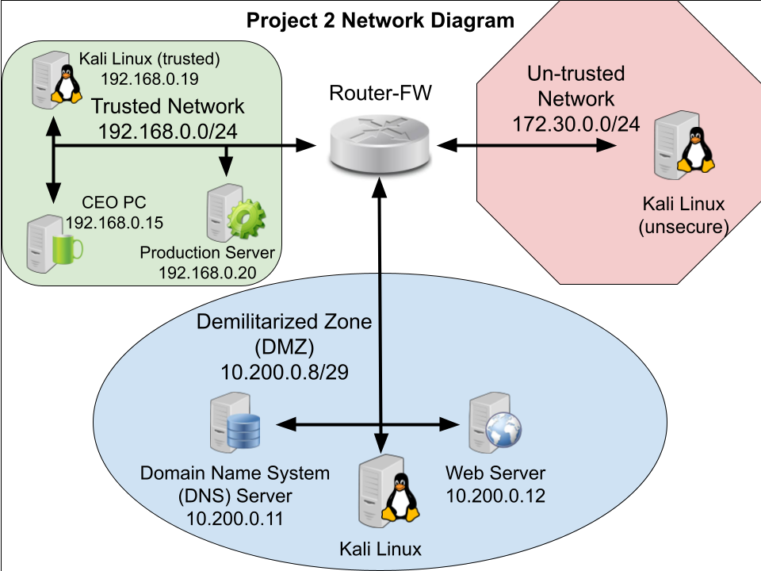

# Career Simulation 2: Security Operations

**TL;DR:** Ran a full vulnerability assessment and exploitation exercise against a Production Server and Web Server in a segmented lab network — enumerated and scored vulnerabilities with `nmap`, exploited the critical vsFTPd 2.3.4 backdoor (CVE-2011-2523, CVSS 10.0) with Metasploit to gain confirmed root access on both hosts, created a persistence account, cracked recovered password hashes, and delivered a full server-hardening recommendation set.

## Scenario

After successfully completing a network upgrade for the client, they requested a follow-on cybersecurity engagement. The client had hired a consultant to install and configure a new server on their internal network to support production and operations. The task: determine the vulnerabilities of the new Production Server and the existing Web Server, and demonstrate specifically how those vulnerabilities could be exploited — including scanning to enumerate vulnerabilities, analyzing them for exploitability, executing exploits against a target, and establishing persistence.

## Environment & Architecture

- **Trusted network** — `192.168.0.0/24` — CEO PC (`192.168.0.15`), the new **Production Server** (`192.168.0.20`), and a trusted Kali Linux VM (`192.168.0.19`)
- **DMZ** — `10.200.0.8/29` — DNS Server (`10.200.0.11`) and **Web Server** (`10.200.0.12`)
- **Untrusted network** — `172.30.0.0/24` — an "unsecure" Kali Linux VM representing an outside attacker position

## Tools & Methodology

1. **Enumeration:** `sudo nmap -sV --script vuln` run against both the Production Server (`192.168.0.20`) and Web Server (`10.200.0.12`), with results saved to text files on the Kali desktop.
2. Cross-referenced each finding's severity against the National Vulnerability Database (NVD) and cvedetails.com to confirm CVE/CVSS numbers.
3. **Exploitation with Metasploit (`msfconsole`):** `search` to find a matching module, `use` to select it, `show options` / `set` to configure target and payload parameters, `exploit` to run it, `back` to return to the top-level console — used to exploit the vsFTPd backdoor and gain a shell on both servers.
4. Ran `whoami` immediately after each successful exploit to confirm the privilege level obtained.
5. **Established persistence:** created a backdoor Linux account directly on the Production Server with `useradd -u 0 -o -g 0 <username>` — the `-u 0 -o` combination assigns the (non-unique) root UID and `-g 0` the root group, granting the new account full root-equivalent rights without needing to re-run the exploit.
6. Retrieved `/etc/passwd` and `/etc/shadow` from the Production Server, combined them with `unshadow`, and ran a dictionary attack with **John the Ripper** to recover plaintext passwords from the hashes.

## Findings

Four most severe vulnerabilities identified (present on both Production Server and Web Server unless noted):

| # | Vulnerability | CVE | CVSS |
|---|---|---|---|
| 1 | vsFTPd 2.3.4 backdoor (port 21/tcp, ftp) | CVE-2011-2523 | 10.0 — Critical |
| 2 | ssl-dh-params / Logjam (port 5432/tcp, postgresql) | CVE-2024-5800 | 8.3 — High |
| 3 | smb-vuln-reg-dos, null-pointer SMBv3 DoS (port 8180/tcp, http — **Web Server only**) | CVE-2022-32230 | 7.5 — High |
| 4 | ssl-ccs-injection, TLS plaintext-injection (port 5432/tcp, postgresql) | CVE-2014-0224 | 7.4 — High |

A fifth notable finding, `rmi-vuln-classloader` (port 1099/tcp, java-rmi) — **CVE-2010-0094, CVSS 7.3 High** — allows arbitrary/remote code execution via the default RMI registry configuration and was present on both servers as well.

**Exposed-data findings (described by type only — no real values reproduced):** the compromised servers contained files with employee PII (candidate lists including names and government ID-style numbers), proprietary business data (safe combinations, proprietary formulas), and an editable copy of the organization's Social Media Security Policy — all discoverable by anyone who obtained the level of access gained here.

**Recovered account credentials** (from the target training image's own `/etc/shadow`, cracked via dictionary attack — training-environment default values, not real accounts): `sys`/`batman`, `klog`/`123456789`, `service`/`service`, `horace`/`password`, `jasper`/`123456`, `aramis`/`1q2w3e`. These illustrate how quickly a basic dictionary attack defeats weak, default-style passwords once the hash file is exposed.

## Proof of Completion

- **Root access, Production Server:** the vsFTPd backdoor exploit returned a shell whose `whoami`-equivalent check (`id`) confirmed `uid=0(root) gid=0(root)`.
- **Persistence:** a backdoor account (username `Robin`, password `H00d` — training-lab values only) was created directly on the Production Server with full root permissions, providing direct re-entry without repeating the exploit.
- **Password recovery:** the six credential pairs above were successfully cracked from the server's own password hashes using John the Ripper.

## Recommendations / Lessons Learned

- **Reduce attack surface:** disable unnecessary services, remove unused software and accounts, and close ports that don't need to be open — a system doing more things has more to defend.
- **Patch and update regularly** — keeping `vsftpd.conf` and similar service configs current is essential to closing known backdoors like CVE-2011-2523.
- **Restrict administrative access** to trusted networks/hosts using access lists or firewall filters, and require SSH-only remote administration.
- **Disable direct root login** — require authentication as a non-privileged user before escalating privileges.
- **Restrict users to their home directories** to limit lateral file access, and **disable anonymous FTP login** so only authenticated users can reach the FTP service.
- **Rate-limit connection attempts** to mitigate brute-force attacks, and **use an external firewall to block SSLv2** traffic (or disable SSLv2 outright) to close off the Logjam/POODLE-class weaknesses found above.
- **Restrict or close unnecessary passive-mode port ranges** to shrink the exposed surface further.
- **Monitor and regularly audit traffic**, maintaining logs for after-the-fact analysis of anomalous activity.

## Authorized Lab Environment Disclaimer

This simulation was conducted entirely within an isolated, sanctioned training environment as part of the QuickStart Cybersecurity Bootcamp (UC Santa Barbara Extension). All exploitation techniques — including Metasploit-based exploitation, backdoor-account creation, and password cracking — were applied only against intentionally vulnerable training systems built for this exercise. None of the tools or techniques described here are authorized for use against any system without explicit permission from its owner.
